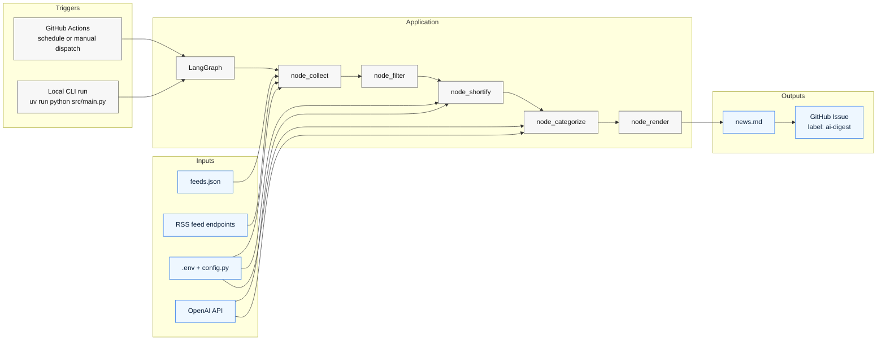
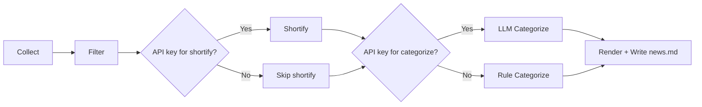

# ai-news-agent

[](https://github.com/nickzren/ai-news-agent/actions/workflows/digest.yml)
[](https://www.python.org/)
[](https://github.com/langchain-ai/langgraph)
[](feeds.json)
[](https://github.com/nickzren/ai-news-agent/issues?q=label%3Aai-digest)
[](LICENSE)

A lightweight AI agent that grabs fresh AI-related headlines and posts a daily digest to GitHub Issues.

🔔 **Watch this repository** to receive the daily AI news digest email delivered straight to your inbox.

## Architecture





## Prerequisites

- Python 3.12+ with pip

## Quick Start

### 1. Install UV

```bash
pip install uv
```

### 2. Configure

```bash
cp .env.example .env
# Edit .env and add your OPENAI_API_KEY
```

### 3. Run
```bash
uv run python src/main.py
```

## Feed configuration

The collector reads RSS feed URLs from [`feeds.json`](feeds.json) in the project root. The
file should contain a JSON object where each key is a feed URL and each value
specifies the `category` and human‑readable `source` name.
