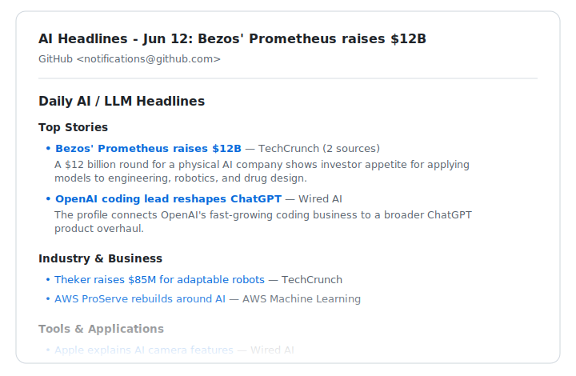

# Daily AI News Digest

One short email a day with the AI news that matters — picked from 25+ trusted sources (TechCrunch, Wired, Ars Technica, The Verge, MIT Technology Review, OpenAI, Google, Meta, and more) and readable in two minutes.

**[📬 Subscribe to the daily email](https://github.com/nickzren/ai-news-agent/subscription)** · **[📖 Read the latest digest](https://github.com/nickzren/ai-news-agent/issues?q=label%3A%22ai-digest%22)**

## How to subscribe (about 30 seconds)

Delivery is handled by GitHub's built-in notifications — free, no newsletter service, no signup form, no ads. You just need a free [GitHub account](https://github.com/signup).

1. Open the **[subscription page](https://github.com/nickzren/ai-news-agent/subscription)** — it's this repository's "Watch" menu.
2. Choose **Custom**, tick **Issues**, and click **Apply**. Each digest is published here as a public daily post, and "Issues" is GitHub's name for those posts.
3. Done — new digests arrive in your inbox each day.

Normally that's one email per day — the digest itself. To stop, open the same page and choose **Unwatch**. If nothing arrives, check that email is enabled in your [notification settings](https://github.com/settings/notifications).

> **Watch, don't star.** Starring bookmarks the repository but doesn't subscribe you to anything — only watching (steps above) delivers the digest.

## What it looks like

From the **June 12, 2026** digest:

- **[Bezos' Prometheus raises $12B](https://techcrunch.com/2026/06/11/jeff-bezoss-prometheus-raises-12b-to-build-an-artificial-general-engineer-for-the-physical-world/)** — TechCrunch
- **[Apple explains AI camera features](https://www.wired.com/story/apple-camera-chief-thinks-ai-can-give-you-superpowers/)** — Wired AI
- **[Pokemon Go data drew military AI scrutiny](https://arstechnica.com/ai/2026/06/pokemon-go-players-unwittingly-contributed-to-tech-with-military-drone-uses/)** — Ars Technica

Each digest leads with the day's top stories, then groups the rest by topic — Industry & Business, Tools & Applications, Policy & Ethics — so you can skim straight to what interests you.

## How it works

Every day, an automated workflow reads the headlines published by the sources in [`feeds.json`](feeds.json), removes duplicates, groups related stories, and asks an AI model to pick the most important ones. The result goes up as a public daily post on this repository, and GitHub emails it to everyone watching.

## FAQ

- **Do I need to be technical?** No. If you can tick a checkbox, you can subscribe.
- **Why GitHub instead of a newsletter?** There's no mailing list and no tracking — GitHub's own notification system delivers the email, and every past digest stays publicly readable.
- **Who picks the stories?** An AI model ranks each day's headlines. The source list is public in [`feeds.json`](feeds.json), so you can see exactly where the news comes from.
- **Can I suggest a source?** Yes — open an issue with the feed you'd like added.

## For developers

- [docs/development.md](docs/development.md) — setup, agent-driven mode, feed configuration
- [docs/architecture.md](docs/architecture.md) — pipeline diagrams and design notes
- [AGENTS.md](AGENTS.md) — runbook for Codex / Claude Code automation

## License

[MIT](LICENSE)
