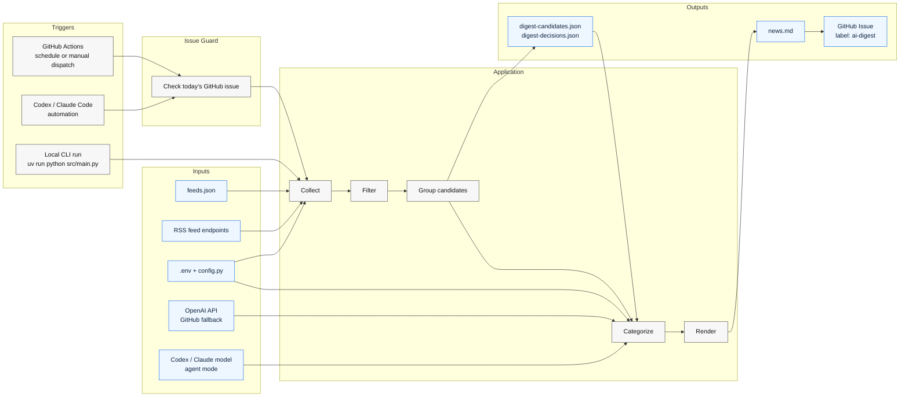
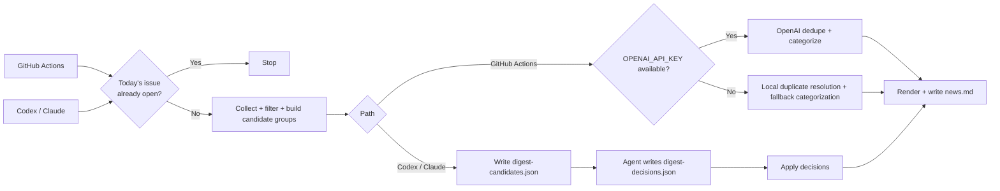

# ai-news-agent

[](https://github.com/nickzren/ai-news-agent/actions/workflows/digest.yml)
[](https://www.python.org/)
[](https://github.com/langchain-ai/langgraph)
[](feeds.json)
[](https://github.com/nickzren/ai-news-agent/issues?q=label%3Aai-digest)
[](LICENSE)

A lightweight AI agent that grabs fresh AI-related headlines and posts a daily digest to GitHub Issues.

🔔 **Watch this repository** to receive the daily AI news digest email delivered straight to your inbox.

Scheduled runs check for today's digest issue before calling the LLM, so fallback CI skips duplicate builds.
Push and pull request CI runs `pytest` and `mypy`.

## Architecture





## Prerequisites

- Python 3.12+ with pip

## Quick Start

### 1. Install UV

```bash
pip install uv
```

### 2. Configure

```bash
cp .env.example .env
# Edit .env and add your OPENAI_API_KEY
```

### 3. Run
```bash
uv run python src/main.py
```

## Agent-driven mode

This path keeps feed collection and filtering in Python, but lets Codex or Claude Code handle dedupe/categorization without `OPENAI_API_KEY`.
For scheduled agent runs, prefer a local runner so the job can use your machine's network and GitHub auth; keep GitHub Actions as the later fallback.

```bash
uv run python src/main.py --candidates-only
# agent reads digest-candidates.json and writes digest-decisions.json
uv run python src/main.py --apply-decisions digest-decisions.json
```

`--candidates-only` writes `digest-candidates.json` by default. Use `--candidates-file <path>` to override the snapshot path for either step.

Runner setup:

- Codex: check today's issue first, run `uv sync --locked`, run `uv run python src/main.py --candidates-only`, write `digest-decisions.json`, then run `uv run python src/main.py --apply-decisions digest-decisions.json`.
- Claude Code: use the same two-step flow and the same `digest-decisions.json` schema.

Agent decisions should use this JSON shape:

```json
{
  "executive_summary": "2-3 sentence overview of today's AI news.",
  "top_stories": ["g1i1"],
  "groups": [
    {
      "group_id": "g1",
      "off_topic_ids": [],
      "clusters": [
        {
          "keep_id": "g1i1",
          "duplicate_ids": ["g1i2"],
          "category": "Tools & Applications",
          "short_title": "OpenAI launches coding assistant",
          "summary_line": "Why this matters in one sentence.",
          "tier": "high"
        }
      ]
    }
  ]
}
```

Use `off_topic_ids` to drop low-signal or off-topic items from a group. For singleton groups, set `clusters` to `[]` and list the item id in `off_topic_ids`.

After `--apply-decisions`, the existing issue publishing step can post `news.md` as usual.

The default digest output is compact and title-first. `executive_summary` and `summary_line` are optional enrichment fields; the renderer keeps top stories and category sections skimmable even when those fields are present.

## Feed configuration

The collector reads RSS feed URLs from [`feeds.json`](feeds.json) in the project root. The
file should contain a JSON object where each key is a feed URL and each value
specifies the `category` and human-readable `source` name.

Optional fields:

- `type`: source-specific handling such as paper limits
- `source_role`: source authority for duplicate tie-breaks and ranking. Supported values: `primary`, `independent_reporting`, `commentary`, `community`.
- `feed_mode`: whether a feed is part of the main digest or supporting discovery only. Supported values: `core`, `discovery_only`.

```json
{
  "https://example.com/feed.xml": {
    "source": "Example Feed",
    "category": "All",
    "type": "news",
    "source_role": "independent_reporting",
    "feed_mode": "core"
  }
}
```

Pipeline notes:

- Exact duplicates are removed by normalized URL before any LLM call.
- Source-specific low-signal items such as webinars, sponsored posts, Academy tutorials, and event promos are dropped before grouping.
- Podcast-style discussion posts from broad news feeds are also filtered before grouping.
- Broad mixed-source feeds can also be gated by source-specific title rules before grouping.
- A per-source cap is applied before LLM dedupe for diversity and lower cost.
- The collector preserves `original_title` and RSS `summary` for duplicate resolution.
- `discovery_only` feeds can still merge into a core story and contribute coverage context, but standalone discovery-only items are dropped before final render.
- When fallback top stories are auto-selected, the digest prefers category diversity before repeating the same lane.
- The LLM receives candidate groups and returns structured duplicate clusters instead of line-based `SKIP` output.
- Short display titles are generated only for kept items after duplicates are resolved.
