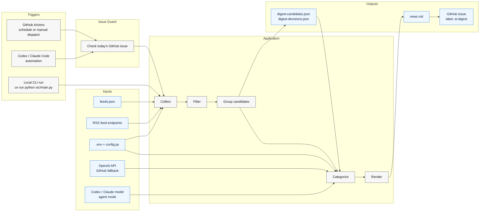
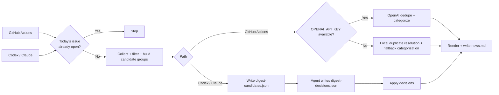

# Architecture

## Pipeline

## Decision flow

## Pipeline notes

- Exact duplicates are removed by normalized URL before any LLM call.
- Source-specific low-signal items such as webinars, sponsored posts, Academy tutorials, and event promos are dropped before grouping.
- Podcast-style discussion posts from broad news feeds are also filtered before grouping.
- Broad mixed-source feeds can also be gated by source-specific title rules before grouping.
- A per-source cap is applied before LLM dedupe for diversity and lower cost.
- The collector preserves `original_title` and RSS `summary` for duplicate resolution.
- Candidate export also writes `digest-run-status.json` with feed health, group counts, and sample `feed_errors` for automation use.
- `--check-issue` writes `digest-issue-status.json` through the same repo-local GitHub path used for publishing, preferring authenticated `gh` locally and `DIGEST_GITHUB_TOKEN`, `GITHUB_TOKEN`, or `GH_TOKEN` in GitHub Actions. On failure it still writes a status artifact with `ok: false`, a `reason`, an `error_kind`, and a `retryable` flag so automation can distinguish transient GitHub failures from hard auth/config errors.
- `--candidates-only` exits nonzero only when feed health is bad enough to make the snapshot unreliable. Healthy empty days are reported as `reason: "no_fresh_items"` without failing.
- `discovery_only` feeds can still merge into a core story and contribute coverage context, but standalone discovery-only items are dropped before final render.
- When fallback top stories are auto-selected, the digest prefers category diversity before repeating the same lane.
- The LLM receives candidate groups and returns structured duplicate clusters instead of line-based `SKIP` output.
- `--dispatch-publish` triggers `.github/workflows/publish-digest.yml` with a compressed digest payload, and that workflow runs the repo-local `--publish-issue` path on GitHub Actions. Direct `--publish-issue` remains a manual fallback.
- Short display titles are generated only for kept items after duplicates are resolved.
