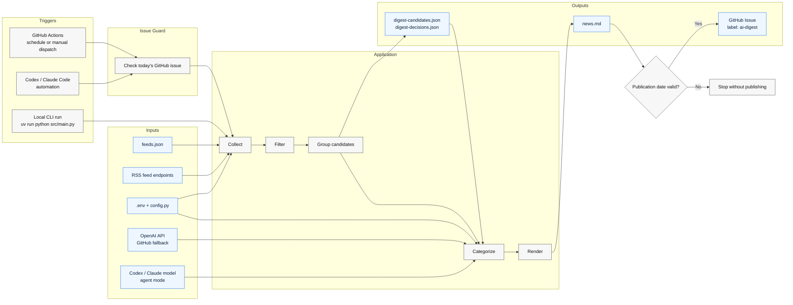
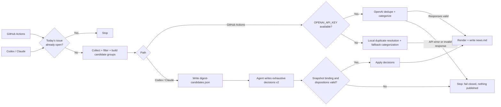

# Architecture

## Pipeline

```mermaid
flowchart LR
    subgraph Trigger[Triggers]
        GH[GitHub Actions<br/>schedule or manual dispatch]
        AGENT[Codex / Claude Code<br/>automation]
        LOCAL[Local CLI run<br/>uv run python src/main.py]
    end

    subgraph Guard[Issue Guard]
        CHECK[Check today's GitHub issue]
    end

    subgraph App[Application]
        C[Collect]
        F[Filter]
        G[Group candidates]
        K[Categorize]
        R[Render]
        C --> F --> G --> K --> R
    end

    subgraph In[Inputs]
        FEEDS[feeds.json]
        RSS[RSS feed endpoints]
        CONF[.env + config.py]
        OAI[OpenAI API<br/>GitHub fallback]
        MODEL[Codex / Claude model<br/>agent mode]
    end

    subgraph Out[Outputs]
        JSON[digest-candidates.json<br/>digest-decisions.json]
        MD[news.md]
        ISSUE[GitHub Issue<br/>label: ai-digest]
    end

    GH --> CHECK --> C
    AGENT --> CHECK
    LOCAL --> C
    FEEDS --> C
    RSS --> C
    CONF --> C
    CONF --> K
    OAI --> K
    MODEL --> K
    G --> JSON
    JSON --> K
    R --> MD
    MD --> DATE{Publication date valid?}
    DATE -- Yes --> ISSUE
    DATE -- No --> STOP[Stop without publishing]

    classDef io fill:#eef7ff,stroke:#1f6feb,stroke-width:1px,color:#0b1f3a;
    classDef proc fill:#f7f7f7,stroke:#555,stroke-width:1px,color:#111;
    class FEEDS,RSS,CONF,OAI,MODEL,JSON,MD,ISSUE io;
    class GH,AGENT,LOCAL,CHECK,C,F,G,K,R,DATE,STOP proc;
```

## Decision flow

```mermaid
flowchart LR
    GH[GitHub Actions] --> T{Today's issue<br/>already open?}
    AGENT[Codex / Claude] --> T
    T -- Yes --> S[Stop]
    T -- No --> C[Collect + filter + build candidate groups]
    C --> P{Path}
    P -- GitHub Actions --> K1{OPENAI_API_KEY available?}
    K1 -- Yes --> L[OpenAI dedupe + categorize]
    K1 -- No --> R[Local duplicate resolution + fallback categorization]
    P -- Codex / Claude --> X[Write digest-candidates.json]
    X --> Y[Agent writes exhaustive decisions v2]
    Y --> V{Snapshot binding and dispositions valid?}
    V -- Yes --> Z[Apply decisions]
    V -- No --> F[Stop: fail closed, nothing published]
    L -- Responses valid --> W[Render + write news.md]
    L -- API error or invalid response --> F[Stop: fail closed, nothing published]
    R --> W
    Z --> W
```

## Pipeline notes

- Exact duplicates are removed by normalized URL before any LLM call.
- Source-specific low-signal items such as webinars, sponsored posts, Academy tutorials, and event promos are dropped before grouping.
- Podcast-style discussion posts from broad news feeds are also filtered before grouping.
- Broad mixed-source feeds can also be gated by source-specific title rules before grouping.
- A per-source cap is applied before LLM dedupe for diversity and lower cost.
- The collector preserves `original_title` and RSS `summary` for duplicate resolution.
- Local fallback only removes items with matching nonempty full headlines within a candidate group, ignoring case and whitespace but preserving punctuation, numbers and word order. Broad grouping is not deletion authority; model/agent decisions are unchanged. The fallback trades more duplicate reports for less risk of deleting distinct events, but identical generic headlines remain ambiguous. See [local duplicate behavior](development.md#api-response-contract).
- Candidate export also writes `digest-run-status.json` with feed health, group counts, and sample `feed_errors` for automation use.
- Candidate schema v5 binds decisions schema v2 through the exact exported `snapshot_id`. Decisions must include every candidate group and disposition every item exactly once. Validation completes before keep promotion; only afterward does rendering remove standalone `discovery_only` keeps.
- `--check-issue` writes `digest-issue-status.json` through the same repo-local GitHub path used for publishing, preferring authenticated `gh` locally and `DIGEST_GITHUB_TOKEN`, `GITHUB_TOKEN`, or `GH_TOKEN` in GitHub Actions. On failure it still writes a status artifact with `ok: false`, a `reason`, an `error_kind`, and a `retryable` flag so automation can distinguish transient GitHub failures from hard auth/config errors.
- `--candidates-only` exits nonzero only when feed health is bad enough to make the snapshot unreliable. Healthy empty days are reported as `reason: "no_fresh_items"` without failing.
- `discovery_only` feeds can still merge into a core story and contribute coverage context, but standalone discovery-only items are dropped before final render.
- When fallback top stories are auto-selected, the digest prefers category diversity before repeating the same lane.
- The LLM receives candidate groups and returns structured duplicate clusters instead of line-based `SKIP` output.
- Categorization has three outcomes. Validated dedupe and enrichment responses proceed to rendering. A missing `OPENAI_API_KEY` may proceed with the existing local heuristic path. An attempted API failure — quota, timeout, connection, malformed response, or invalid dispositions including missing, repeated, unknown, or overlapping IDs — raises before rendering. The complete response is validated before applying its contents or promoting a keep; see the [API response contract](development.md#api-response-contract).
- `--dispatch-publish` triggers `.github/workflows/publish-digest.yml` with a compressed digest payload, and that workflow runs the repo-local `--publish-issue` path on GitHub Actions. Direct `--publish-issue` remains a manual fallback.
- Short display titles are generated only for kept items after duplicates are resolved.
- Publication uses one frozen Eastern date for dispatch inputs, title generation and issue selection. Actions requires `DIGEST_DATE`; missing, malformed or noncurrent dates fail closed, with a second date check after issue lookup before starting a write.
- `digest.yml` and `publish-digest.yml` share one repository-wide Actions concurrency group, retain pending runs with `queue: max`, and do not cancel the active run. Direct manual publication bypasses that lock. See [publication safety and rollout limits](development.md#publication-safety).
